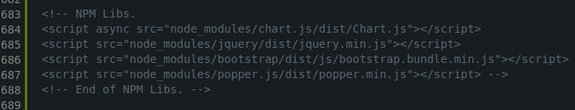
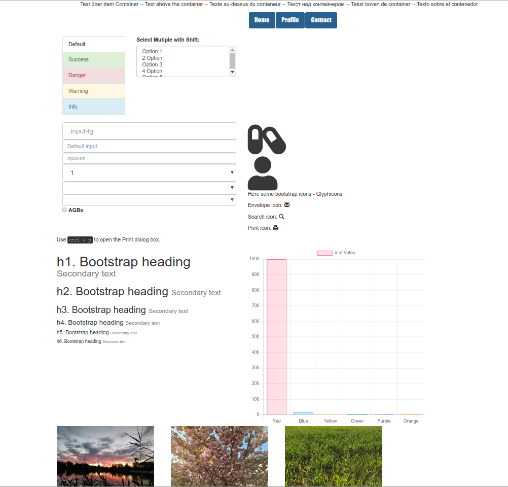
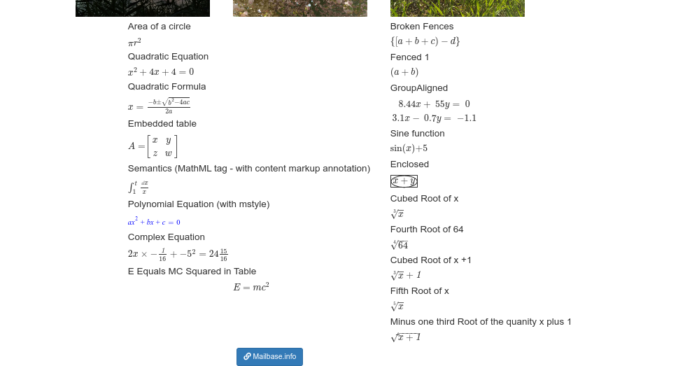

# Responsive Webpage Template

This template is a boilerplate for Webpages:

- A HTML5/Bootstrap/JQuery Web-Template containing solid and nice frameworks (mainly JS).

- The "Template" Code is heavily commented.

- Features a lot of good CSS configurations.

- All Frameworks/Libraries are updateable by the pagemanager NPM.

- Development Tools like ESlint are on board and can be installed by a seperate Flag.

- For development, you can use any IDE of you want, however a VisualStudio Code Workspace is preconfigurated.

 

 -------

<h4>NPM </h4>

By default static libs are included in the Index.html.
You need to exclude the static libs and include the NPM Libs after downloading them through the package manager.

  

 

<b> How to set the Page up for Development </b>

    cd /Template Folder
    npm install

 

**If you want to Upload the Page**

    npm prune --production
 
 This removes all Development Tools (ESlint etc.)
 
 -------
 
 
  
 
  
 
 
